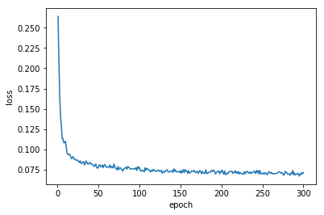
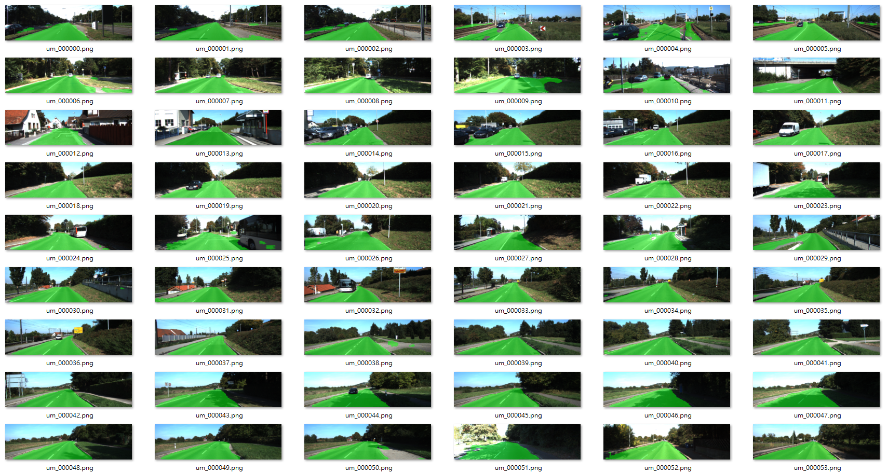
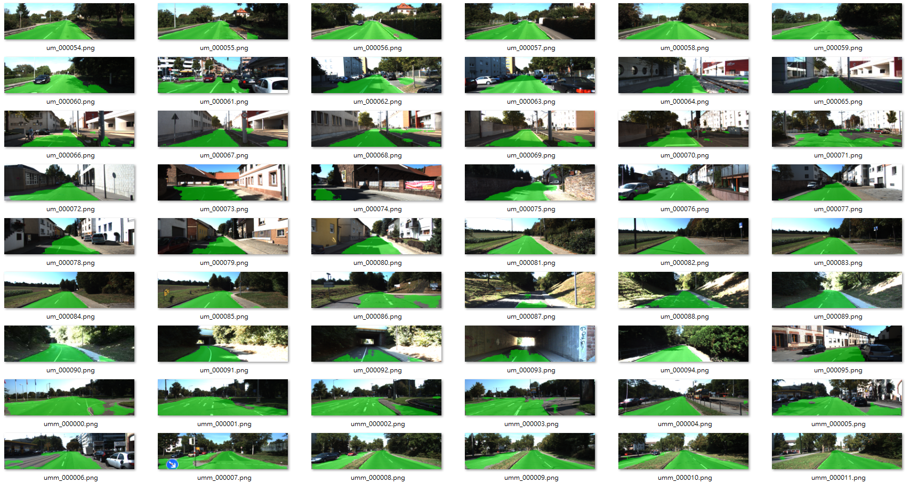
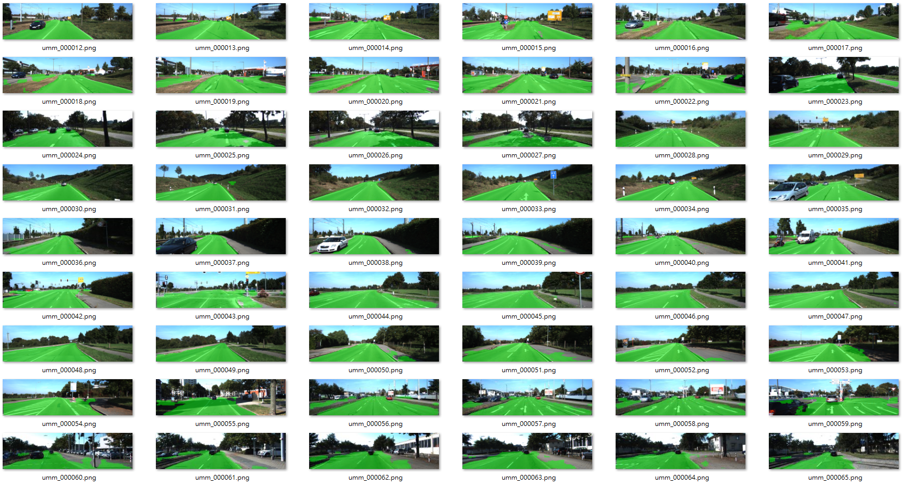
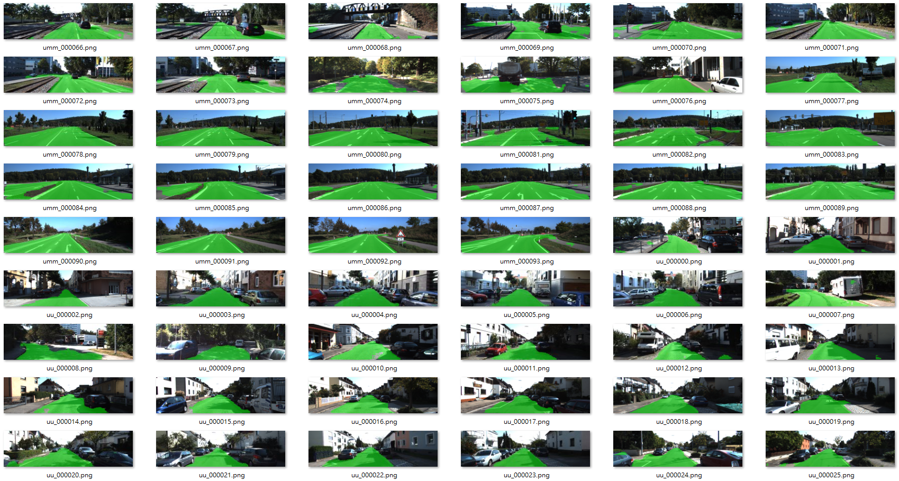
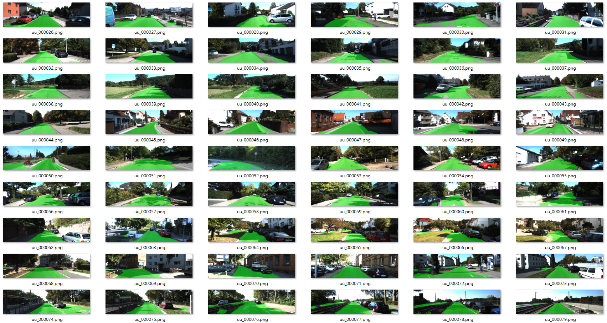
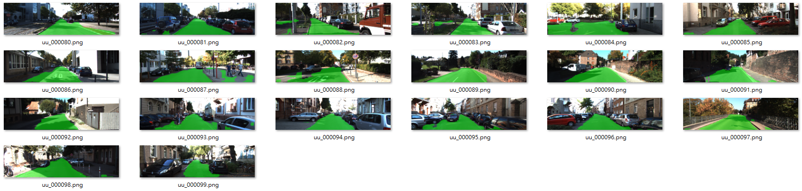

# Semantic Segmentation
### Introduction
In this project, you'll label the pixels of a road in images using a Fully Convolutional Network (FCN).

### Setup
##### Frameworks and Packages
Make sure you have the following is installed:
 - [Python 3](https://www.python.org/)
 - [TensorFlow](https://www.tensorflow.org/)
 - [NumPy](http://www.numpy.org/)
 - [SciPy](https://www.scipy.org/)
##### Dataset
Download the [Kitti Road dataset](http://www.cvlibs.net/datasets/kitti/eval_road.php) from [here](http://www.cvlibs.net/download.php?file=data_road.zip).  Extract the dataset in the `data` folder.  This will create the folder `data_road` with all the training a test images.

### Start
##### Implement
Implement the code in the `main.py` module indicated by the "TODO" comments.
The comments indicated with "OPTIONAL" tag are not required to complete.
##### Run
Run the following command to run the project:
```
python main.py
```
**Note** If running this in Jupyter Notebook system messages, such as those regarding test status, may appear in the terminal rather than the notebook.

----
## [Rubric](https://review.udacity.com/#!/rubrics/1020/view)

### Build the Neural Network
1. Does the project load the pretrained vgg model?
2. Does the project learn the correct features from the images?
3. Does the project optimize the neural network?
4. Does the project train the neural network?
> Four tests, `tests.test_load_vgg(load_vgg, tf)`, `tests.test_layers(layers)`, `tests.test_optimize(optimize)`, and `tests.test_train_nn(train_nn)` are passed correctly. However, If I do data_augmentation in `train_nn` with my own class (this line: `img, label_mask = dataAug.do(img,label_mask)`), `tests.test_train_nn(train_nn)` will got error. I'm not sure what happens but I have verified that my augmentation function is correct and works fine during training.
> Also, loss is certainly printed while training.
```python
in train_nn() function:
print("EPOCH {} with {} training time...".format(itr+1,etime - stime))
print("\t ",loss_per_epoch)
```

### Neural Network Training
1. Does the project train the model correctly? On average, the model decreases loss over time.
> 

2. Does the project use reasonable hyperparameters?
> * epoch number = 300
> * batch_size = 4
> * Adam learning rate = 0.001, with a decreasing value w.r.t. epoch
> * l2 regularizations with value 1e-3 in decoder part. (manually add regularization loss with xent loss)
> * Data augmentation with three types of pre-processing: flip, create shadow, blur
> * As suggested in Tips, I scaled `vgg_layer3_out` and `vgg_layer4_out` in decoder part. It really produces more accurate images.
> * VGG parameters are not updated during training. Pass variables in decoder part to optimizer: `train_op = optimizer.minimize(loss_operation, var_list = trainable_collection)`
```python
with tf.variable_scope('decoder'):
    layer_output = layers(l3out, l4out, l7out, num_classes)
vars_decoder = tf.get_collection(tf.GraphKeys.TRAINABLE_VARIABLES,scope='decoder')
# We only update variables in this collection, vars_decoder, which will pass to optimizer later
```

3. Does the project correctly label the road?
> Since we don't have the ground truth for test images. We can only measure by eye. These are the results:






